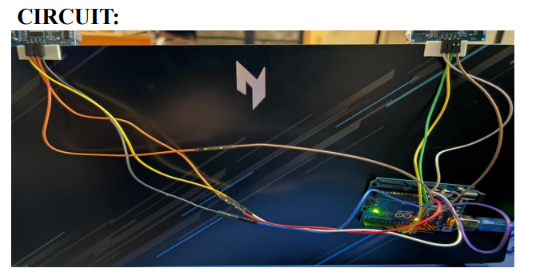
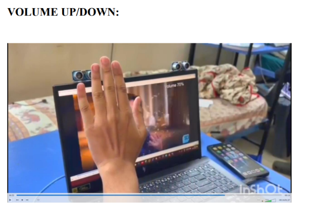

#  Smart Hand Gesture Control System

<p align="center">


</p>

---

##  Overview

The **Smart Hand Gesture Control System** is a touchless Human-Computer Interaction (HCI) project that enables users to control computer functions using simple hand gestures. The system utilizes **Arduino Uno**, **HC-SR04 Ultrasonic Sensors**, and **Python** to recognize hand movements and convert them into computer commands.

This project demonstrates an affordable and efficient gesture-based interface that can be used for presentations, media control, and accessibility applications.

---

##  Features

-  Touchless Hand Gesture Recognition
-  Cursor & Mouse Control
-  Next Slide
-  Previous Slide
-  Volume Up / Down
-  Real-Time Gesture Detection
-  Python-Arduino Serial Communication
-  Low Cost & Easy to Build

---

##  Hardware Requirements

- Arduino Uno
- HC-SR04 Ultrasonic Sensors
- Breadboard
- Jumper Wires
- USB Cable

---

##  Software Requirements

- Arduino IDE
- Python 3.x
- OpenCV
- PySerial
- PyAutoGUI

---

##  Project Structure

```
Smart-Hand-Gesture-Control-System
│
├── arduino code/
│      gesture.control.ino
│
├── python code/
│      python code.txt
│
├── images/
│      circuit diagram.png
│      circuit.png
│      play-pause.png
│      volume up-down.png
│
├── REPORT/
│      report.pdf
│
├── README.md
├── LICENSE
└── .gitignore
```

---

##  Working Principle

1. Hand movement is detected using ultrasonic sensors.
2. Arduino processes the distance values.
3. Sensor data is transmitted to Python through Serial Communication.
4. Python interprets the gesture.
5. Corresponding computer actions are executed instantly.

---

##  Project Demo

▶ **Watch the Complete Demo Video**

**https://drive.google.com/file/d/1MdnQXskgsOg6xsDrl0HZ7sqBsIohdeHR/view?usp=sharing**

> *Click the link above to watch the complete working demonstration.*


---

##  Project Images

### Circuit Diagram

<p align="center">

</p>

### System Circuit

<p align="center">

</p>

### Gesture - Play / Pause

<p align="center">

</p>

### Gesture - Volume Control

<p align="center">

</p>

---

##  Applications

- Smart Presentations
- Touchless PC Control
- Media Player Control
- Smart Classroom
- Assistive Technology
- Human-Computer Interaction
- Home Automation

---

##  Future Scope

- AI-Based Gesture Recognition
- Machine Learning Integration
- Webcam-Based Gesture Detection
- IoT Integration
- Smart Home Automation
- Multi-Hand Gesture Support

---

##  Author

**Srajan Gupta**

B.Tech Electronics and Communication Engineering (ECE)

VIT Vellore

GitHub: https://github.com/xsrajangupta

---

## ⭐ Support

If you found this project useful, consider giving it a **⭐ Star** on GitHub!

It motivates me to build and share more open-source projects.
